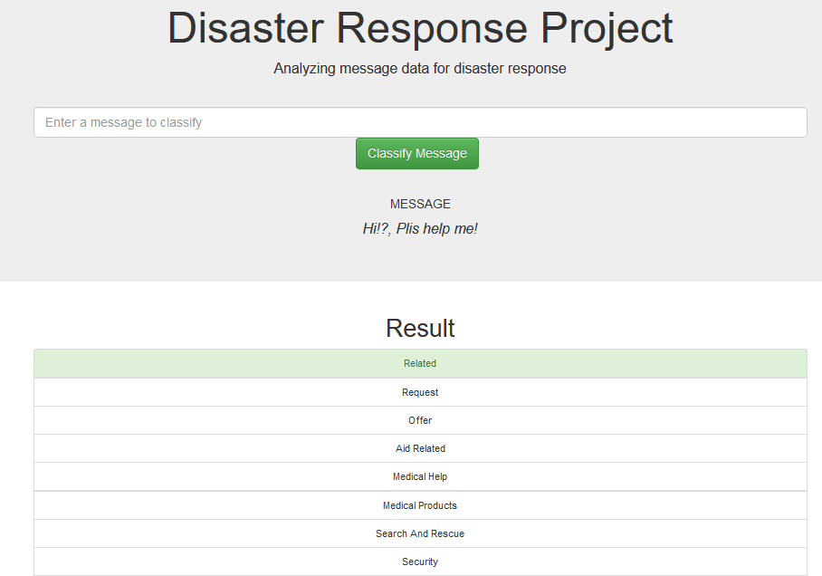
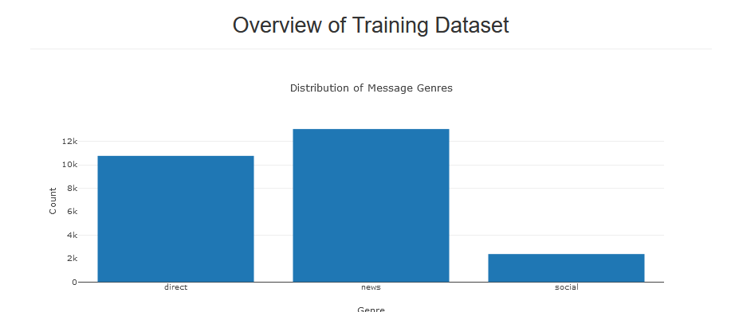

# Data Scientist Nanodegree

This repository contains my progress associated with my Udacity Data Scientist Nanodegree.

## Project 2: Disaster Response

### The libraries used in this work correspond to

numpy
pandas
sklearn
pandas
sqlalchemy
nltk
re
sklearn
pickle

### Project Motivation

In this project, I applied the skills learned in this course, particularly those related to 'Data Engineering.' The goal was to create a classifier to categorize real messages sent during disastrous events. Additionally, the project includes a web application with which it is possible to interact.

### File Description

This work consists of the following folders.

## app
- templates
  - go.html #classification result in app web
  - master.html #main page
- run.py #to run app web

## data
- disaster_categories.csv #data
- disaster_messages.csv #data
- DisasterResponse.db #database to save clean data
- process_data #cleaning process
- YourDataBaseName.db #database to save clean data

## models
- train_classifier.py #pipeline ML
- classifier-pkl #saved classifier

### Screenshot App Web

### Licensing, Authors, and Acknowledgements

Acknowledgements to data-science nanodegree course for the template codes.

